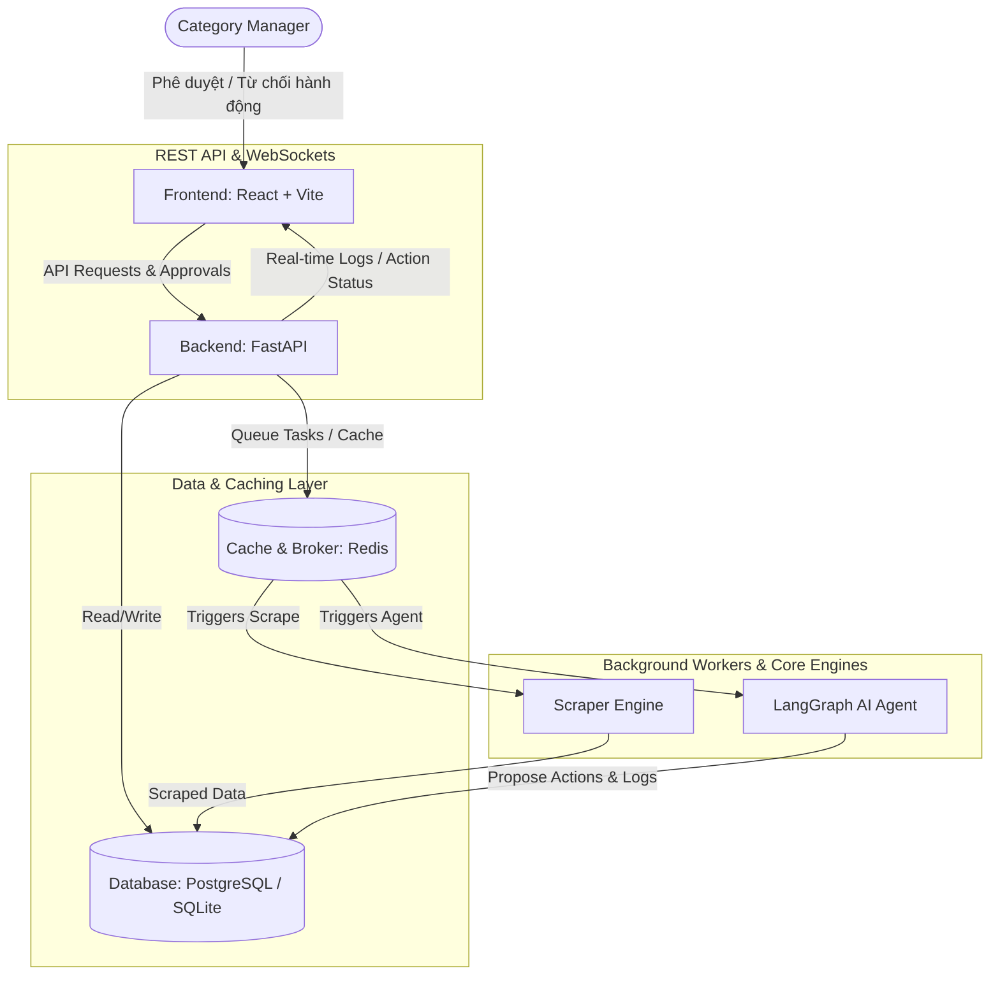
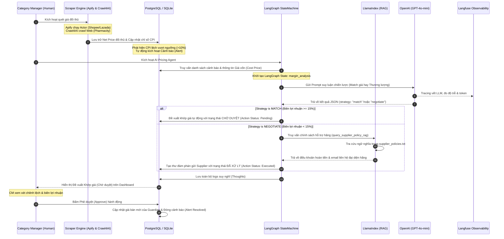
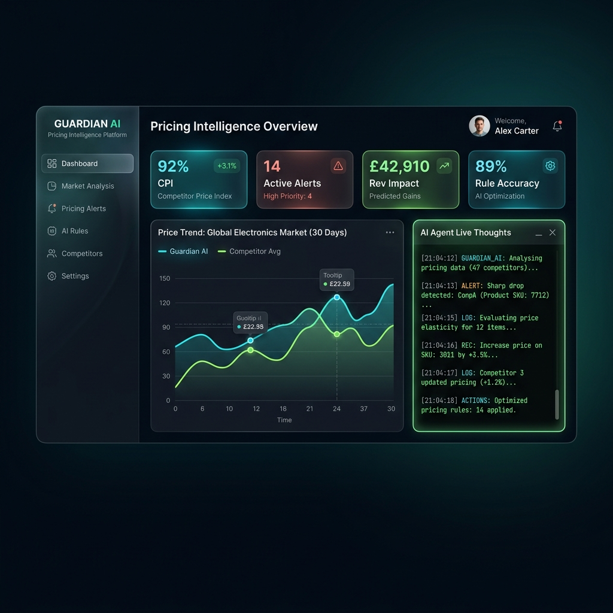

# GUARDIAN - Real-Time Pricing & Human-in-the-Loop AI Agent Platform

Đây là bộ mã nguồn Boilerplate (Khung dự án chuẩn) phục vụ cho cuộc thi AI Hackathon. Hệ thống tích hợp khả năng giám sát giá đa kênh thời gian thực (Shopee, Lazada, TikTok Shop, GrabMart) đối với Top 200 SKU và vận hành **LangGraph AI Agent** kết hợp cơ chế kiểm soát phê duyệt của con người (**Human-in-the-Loop - HITL**) nhằm tối ưu hóa biên lợi nhuận một cách an toàn và tin cậy.

---

## 🚀 Kiến Trúc Hệ Thống & Luồng Công Việc (Workflows)

### 1. Sơ Đồ Kiến Trúc MVP (MVP System Architecture)
Sơ đồ dưới đây mô tả cấu trúc hoạt động của sản phẩm ở mức tối thiểu khả thi (MVP), thể hiện sự phân tách giữa Frontend (React), Backend (FastAPI), Database (PostgreSQL/SQLite), Caching/Broker (Redis) và các worker xử lý nền.



---

### 2. Luồng Phối Hợp Giữa Các Frameworks AI & Human-in-the-Loop (HITL Workflow)
Sơ đồ này mô tả cách thức các thư viện và nền tảng AI nâng cao (**LangGraph, Crawl4AI, Apify, LlamaIndex, OpenAI và Langfuse**) phối hợp với nhau và tích hợp cơ chế phê duyệt thủ công (**Human-in-the-Loop**) để xử lý chênh lệch giá một cách an toàn:



---

## 🧠 Vai Trò Của AI Agent & Human-in-the-Loop (HITL)

Trong nền tảng **GUARDIAN**, AI Pricing Agent không hoạt động một cách mù quáng mà phối hợp chặt chẽ với Category Manager qua cơ chế **Human-in-the-Loop (HITL)**:

1.  **Market Observer Agent (Giám sát & Phát hiện Bất thường):**
    *   *Nhiệm vụ:* Theo dõi liên tục biến động giá Net Price của đối thủ trên các kênh Shopee, Lazada, TikTok Shop, GrabMart bằng **Apify** và **Crawl4AI**.
2.  **Margin Guardian Agent (Đề xuất tối ưu bằng LangGraph):**
    *   *Nhiệm vụ:* Khi phát hiện phá giá, Agent sử dụng đồ thị trạng thái **LangGraph** để lập luận. Nếu biên lợi nhuận ròng dự kiến đạt trên ngưỡng an toàn (>15%), Agent sẽ tạo một hành động **AUTO_PRICE_MATCH** ở trạng thái **Pending (Chờ duyệt)** thay vì tự động đổi giá ngay lập tức, đảm bảo quyền kiểm soát tối cao thuộc về con người.
3.  **Supplier Negotiator Agent (Đàm phán viên ảo bằng LlamaIndex RAG):**
    *   *Nhiệm vụ:* Nếu biên lợi nhuận rớt xuống dưới ngưỡng an toàn (<15%), Agent chuyển hướng đàm phán, tự động dùng **LlamaIndex** tra cứu các điều khoản giảm giá nhập trong hợp đồng (`supplier_policies.txt`) và soạn thư nháp hoàn chỉnh gửi Supplier.
4.  **Category Manager (Quyền phê duyệt tối cao):**
    *   *Nhiệm vụ:* Category Manager chỉ cần mở **AI Agent Workspace**, xem xét các hành động khớp giá do AI đề xuất và bấm **Duyệt Khớp Giá (Approve)** hoặc **Từ Chối (Reject)** để kiểm soát rủi ro kinh doanh.

---

## 📁 Cấu Trúc Thư Mục

```text
├── backend/                  # FastAPI Application
│   ├── app/
│   │   ├── db/               # SQLAlchemy Session & Models (sqlite/postgres)
│   │   ├── routes/           # API Endpoints (Products, Alerts, Scraper, Agent)
│   │   ├── services/         # CPI Calculator, LangGraph Agent Loop Engine
│   │   ├── scraper/          # Scraper Engine (Crawl4AI & Apify API client)
│   │   ├── schemas.py        # Pydantic schemas
│   │   ├── config.py         # Cấu hình môi trường (SQLite/PostgreSQL)
│   │   └── main.py           # Entrypoint khởi tạo FastAPI
│   └── requirements.txt      # Thư viện Python yêu cầu
├── frontend/                 # React + Vite Client
│   ├── src/
│   │   ├── pages/            # Overview, ProductInsights, AgentWorkspace, Configuration
│   │   ├── App.jsx           # Main routing & state
│   │   ├── index.css         # Custom Premium CSS Variables & Styles
│   │   └── main.jsx          # Entrypoint React
│   ├── package.json          # npm packages
│   └── vite.config.js        # Vite config
├── scripts/                  # Công cụ & Kịch bản bổ trợ
│   ├── generate_mock_data.py # Tạo 200 SKU & Seed CSDL
│   ├── test_backend.py       # Kiểm thử API Endpoints tự động
│   └── test_matching_agent.py# Kiểm thử độ tương đồng khử nhiễu LlamaIndex
├── mock_data/                # Tệp tin mẫu phục vụ demo
│   └── guardian_master_sku.csv # Tệp sản phẩm chuẩn để nạp động
├── docs/                     # Tài liệu & Pitch Deck dàn ý
├── docker-compose.yml        # PostgreSQL & Redis container setup (Tùy chọn)
└── .env                      # Cấu hình biến môi trường
```

---

## 🛠️ Hướng Dẫn Cài Đặt & Chạy Dự Án

### 1. Cài đặt Backend & Khởi tạo Dữ liệu
Mở Terminal tại thư mục gốc của dự án:

```bash
# 1. Tạo môi trường ảo Python 3.12 (khuyên dùng để có sẵn gói wheels cho Windows)
py -3.12 -m venv .venv312

# 2. Kích hoạt môi trường ảo
.venv312\Scripts\activate

# 3. Cài đặt các thư viện (Đã bao gồm LangGraph, Crawl4AI, Apify, LlamaIndex, Langfuse)
pip install -r backend/requirements.txt

# 4. Tạo dữ liệu giả lập & Seed vào Database SQLite (guardian.db)
python scripts/generate_mock_data.py --db

# 5. Khởi chạy Backend Server
cd backend
uvicorn app.main:app --reload
```
API Docs sẽ có sẵn tại: `http://localhost:8000/docs`

### 2. Cài đặt & Chạy Frontend Dashboard
Mở cửa sổ Terminal mới:

```bash
cd frontend
npm install
npm run dev
```
Truy cập giao diện tại: `http://localhost:3000`

### 3. Kiểm thử thuật toán khử nhiễu của Agent
Kiểm tra xem hệ thống khớp giá và loại bỏ sản phẩm sai định lượng dung tích hoạt động như thế nào bằng lệnh:
```bash
python scripts/test_matching_agent.py
```
---
*Chúc các bạn đạt giải cao nhất trong cuộc thi AI Hackathon sắp tới!*

