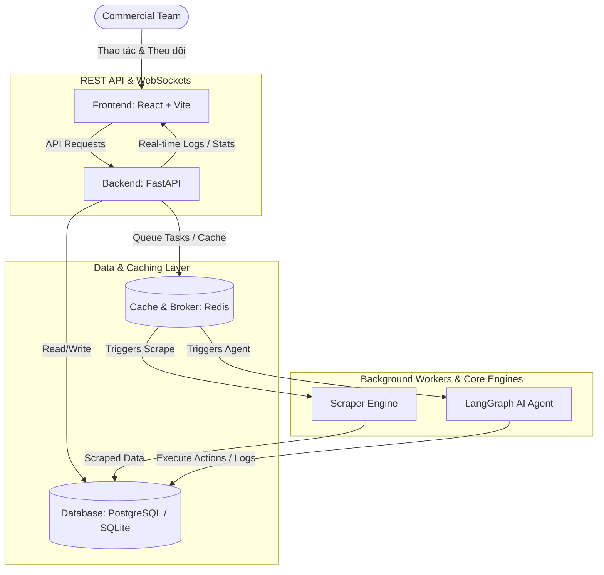
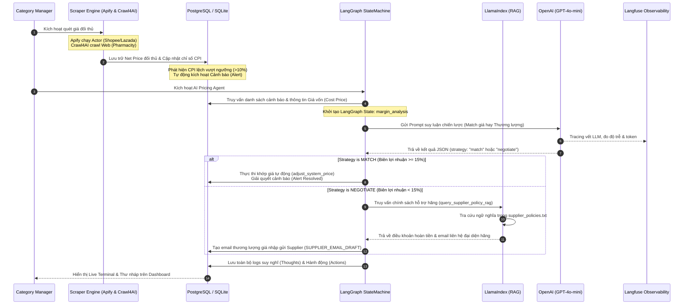

# GUARDIAN - Real-Time Pricing Intelligence & AI Agent Platform

Đây là bộ mã nguồn Boilerplate (Khung dự án chuẩn) phục vụ cho cuộc thi AI Hackathon. Hệ thống tích hợp khả năng giám sát giá đa kênh thời gian thực (Shopee, Lazada, TikTok Shop, GrabMart) đối với Top 200 SKU và vận hành **AI Pricing Agent** tự động để tối ưu hóa biên lợi nhuận.

---

## 🚀 Kiến Trúc Hệ Thống & Luồng Công Việc (Workflows)

### 1. Sơ Đồ Kiến Trúc MVP (MVP System Architecture)
Sơ đồ dưới đây mô tả cấu trúc hoạt động của sản phẩm ở mức tối thiểu khả thi (MVP), thể hiện sự phân tách giữa Frontend (React), Backend (FastAPI), Database (PostgreSQL/SQLite), Caching/Broker (Redis) và các worker xử lý nền.



---

### 2. Luồng Phối Hợp Giữa Các Frameworks AI (Framework Collaboration Workflow)
Sơ đồ này mô tả cách thức các thư viện và nền tảng AI nâng cao bao gồm **LangGraph, Crawl4AI, Apify, LlamaIndex, OpenAI và Langfuse** phối hợp với nhau trong một vòng lặp tự trị đóng để xử lý chênh lệch giá:



---

## 🧠 Vai Trò Của AI Agent Trong Hệ Thống (Agent Roles)

Trong nền tảng **GUARDIAN**, AI Pricing Agent đóng vai trò cốt lõi, thay thế các quy trình nghiệp vụ thủ công phức tạp bằng chuỗi hành vi thông minh tự trị (Autonomous Agentic Workflows):

1.  **Market Observer (Giám sát & Phát hiện Bất thường):**
    *   *Vai trò:* Theo dõi liên tục biến động giá Net Price của toàn bộ Top 200 SKU trên các kênh Shopee, Lazada, TikTok Shop, GrabMart.
    *   *Hành vi:* Phát hiện lập tức các hành vi phá giá của đối thủ hoặc cơ hội tăng giá của Guardian khi đối thủ hết hàng/tăng giá, tự động kích hoạt cảnh báo tương ứng với mức độ nghiêm trọng (High, Medium, Low).

2.  **Margin Guardian (Bảo vệ Biên lợi nhuận):**
    *   *Vai trò:* Là chốt chặn bảo mật an toàn tài chính của doanh nghiệp.
    *   *Hành vi:* Thay vì tự động giảm giá mù quáng theo đối thủ để cạnh tranh (dẫn đến chiến tranh giá phá hủy biên lợi nhuận), Agent luôn đối chiếu giá đối thủ với **Cost Price (Giá vốn)** của sản phẩm để bảo vệ biên lợi nhuận tối thiểu được quy định trong cấu hình (mặc định là 15%).

3.  **Autonomous Decision-Maker (Quyết định Điều phối):**
    *   *Vai trò:* Phân tích đa chiều và đưa ra phương án xử lý tối ưu.
    *   *Hành vi:* Sử dụng các quy tắc nghiệp vụ kết hợp suy luận để phân loại sản phẩm và quyết định: khi nào nên **Auto-Match giá** để chiếm lĩnh thị phần, khi nào nên **Maintain giá** để bảo toàn lợi nhuận, và khi nào nên **Yêu cầu hỗ trợ giá nhập**.

4.  **Supplier Negotiator (Đàm phán viên ảo):**
    *   *Vai trò:* Hỗ trợ Category Manager soạn thảo đàm phán với nhà cung cấp.
    *   *Hành vi:* Khi giá bán của đối thủ giảm xuống dưới mức giá vốn an toàn của Guardian, Agent sẽ tự động soạn thảo email đề xuất đàm phán (Purchase Cost Rebates) gửi nhà cung cấp dựa trên thông tin nhà sản xuất của sản phẩm đó, giúp doanh nghiệp đạt được chi phí nhập rẻ hơn mà không cần Category Manager ngồi viết email thủ công cho từng nhà cung cấp.

---

## 📁 Cấu Trúc Thư Mục

```text
├── backend/                  # FastAPI Application
│   ├── app/
│   │   ├── db/               # SQLAlchemy Session & Models (sqlite/postgres)
│   │   ├── routes/           # API Endpoints (Products, Alerts, Scraper, Agent)
│   │   ├── services/         # CPI Calculator, LangGraph Agent Loop Engine
│   │   ├── scraper/          # Scraper Engine (Crawl4AI & Apify API client)
│   │   ├── schemas.py        # Pydantic schemas
│   │   ├── config.py         # Cấu hình môi trường (SQLite/PostgreSQL)
│   │   └── main.py           # Entrypoint khởi tạo FastAPI
│   └── requirements.txt      # Thư viện Python yêu cầu
├── frontend/                 # React + Vite Client
│   ├── src/
│   │   ├── pages/            # Overview, ProductInsights, AgentWorkspace, Configuration
│   │   ├── App.jsx           # Main routing & state
│   │   ├── index.css         # Custom Premium CSS Variables & Styles
│   │   └── main.jsx          # Entrypoint React
│   ├── package.json          # npm packages
│   └── vite.config.js        # Vite config
├── scripts/                  # Công cụ & Kịch bản bổ trợ
│   ├── generate_mock_data.py # Tạo 200 SKU & Seed CSDL
│   └── test_backend.py       # Kiểm thử API Endpoints tự động
├── docs/                     # Tài liệu & Pitch Deck dàn ý
├── docker-compose.yml        # PostgreSQL & Redis container setup (Tùy chọn)
└── .env                      # Cấu hình biến môi trường
```

---

## 🛠️ Hướng Dẫn Cài Đặt & Chạy Dự Án

### 1. Cài đặt Backend & Khởi tạo Dữ liệu
Mở Terminal tại thư mục gốc của dự án:

```bash
# 1. Tạo môi trường ảo Python
python -m venv .venv

# 2. Kích hoạt môi trường ảo
# Trên Windows:
.venv\Scripts\activate
# Trên macOS/Linux:
source .venv/bin/activate

# 3. Cài đặt các thư viện (Đã bao gồm LangGraph, Crawl4AI, Apify, LlamaIndex, Langfuse)
pip install -r backend/requirements.txt

# 4. Tạo dữ liệu giả lập & Seed vào Database SQLite (guardian.db)
python scripts/generate_mock_data.py --db

# 5. Khởi chạy Backend Server
cd backend
uvicorn app.main:app --reload
```
API Docs sẽ có sẵn tại: `http://localhost:8000/docs`

### 2. Cài đặt & Chạy Frontend Dashboard
Mở cửa sổ Terminal mới:

```bash
cd frontend
npm install
npm run dev
```
Truy cập giao diện tại: `http://localhost:3000`

### 3. Kiểm thử API tự động
Bạn có thể kiểm tra xem các API có hoạt động đúng không bằng cách chạy:
```bash
python scripts/test_backend.py
```
