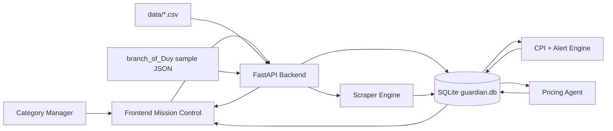
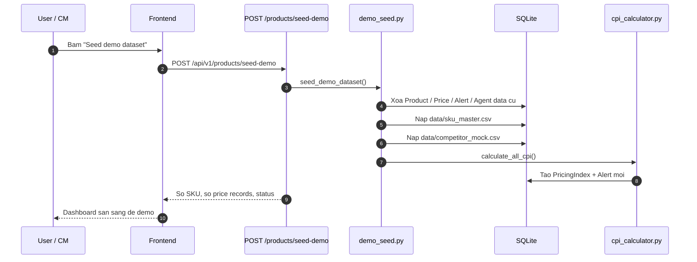
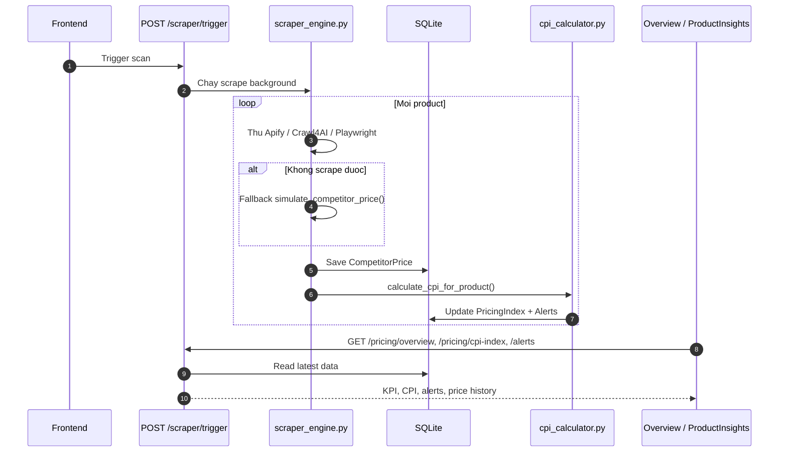
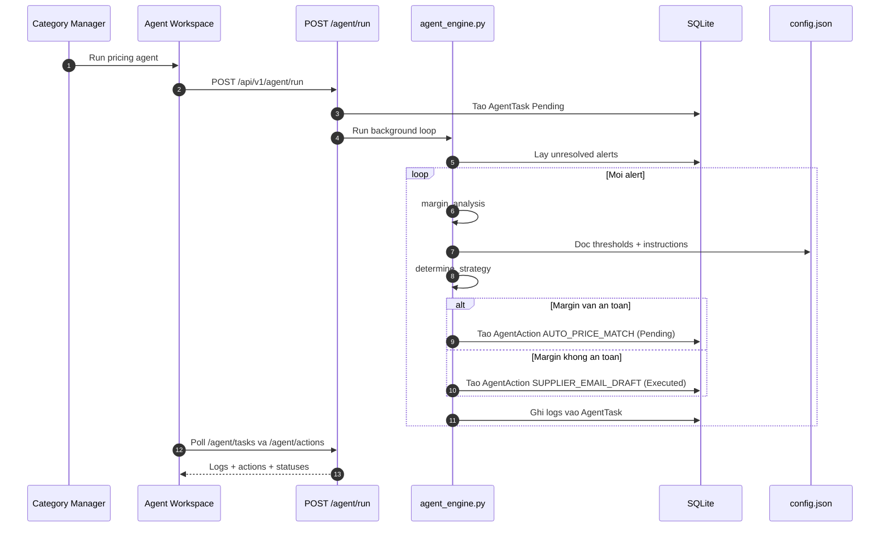
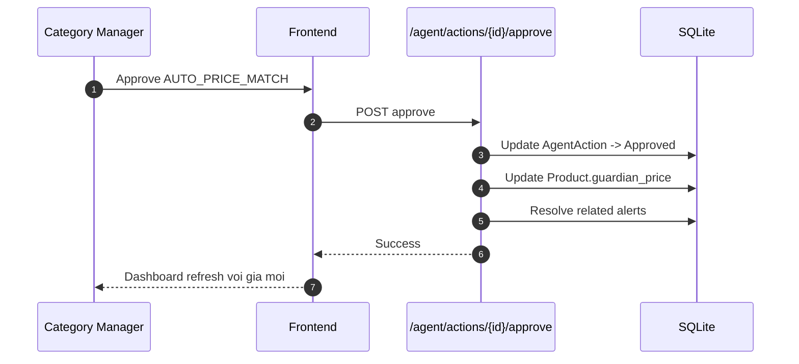

# GUARDIAN Pricing Command Center

GUARDIAN la mot MVP cho bai toan hackathon "Real-time price checking and comparison". He thong tap trung vao 3 viec:

- Gom du lieu gia da kenh thanh mot `single source of truth`
- Tinh CPI va phat hien chenh lech gia quan trong
- Cho AI agent de xuat hanh dong theo vong `Perceive -> Reason -> Act`, nhung van co `human-in-the-loop`

## Demo story

San pham hien tai phu hop de demo theo flow nay:

1. Seed bo du lieu 200 SKU va lich su gia doi thu
2. Mo dashboard `Agentic Pricing Mission Control`
3. Xem alert queue, CPI, channel map, va branch scrape evidence
4. Chay autonomous agent de agent tu refresh gia thi truong roi moi reasoning
5. Duyet hoac tu choi cac de xuat `AUTO_PRICE_MATCH`

## Kha nang chinh

- Backend `FastAPI + SQLAlchemy + SQLite`
- Frontend `React + Vite + Recharts`
- Du lieu demo gom `200` SKU va `8400` competitor price records
- Agent tu dong phan tich margin truoc khi de xuat match gia
- Agent da co tool layer ro rang cho margin, price-match proposal, supplier policy lookup, va email draft
- Da san sang trace qua Langfuse neu cung cap credentials that
- RAG mock cho supplier negotiation draft
- Import duoc sample scrape tu `branch_of_Duy`

## Kien truc tong quan

```text
Frontend (React)
  -> goi REST API
Backend (FastAPI)
  -> doc/ghi SQLite
  -> tinh CPI, tao alert
  -> chay agent loop
  -> expose scrape evidence
Data
  -> data/sku_master.csv
  -> data/competitor_mock.csv
  -> dataset_shopee-scraper_*.json
```

## Workflow

### 1. System workflow



### 2. Seed demo workflow



### 3. Scrape and pricing intelligence workflow



### 4. Agent workflow



### 5. Human approval workflow



## Cau truc thu muc

```text
backend/
  app/
    config.py
    schemas.py
    main.py
    db/
    routes/
    scraper/
    services/
  data/
frontend/
  src/
    App.jsx
    index.css
    pages/
scripts/
data/
docs/
```

## Cac man hinh frontend

### `Overview`

Trang tong quan da duoc doi thanh mission control:

- KPI ve CPI, alert, pending approvals, channel coverage
- Live reasoning trace tu agent task gan nhat
- Priority queue cho cac case can xu ly truoc
- Branch scrape evidence tu `branch_of_Duy`
- Alert feed va recent actions

### `ProductInsights`

- Danh sach SKU
- Chi tiet 1 san pham
- Bang so sanh guardian vs competitor
- Bieu do lich su net price

### `AgentWorkspace`

- Chay agent loop
- Xem logs
- Xem va approve/reject cac agent actions
- Xem supplier negotiation draft

### `Configuration`

- Dieu chinh threshold
- Upload CSV SKU
- Seed lai demo dataset

## Backend APIs quan trong

### Products

- `GET /api/v1/products`
- `GET /api/v1/products/{product_id}`
- `POST /api/v1/products`
- `PUT /api/v1/products/{product_id}`
- `POST /api/v1/products/import-csv`
- `POST /api/v1/products/seed-demo`

### Pricing

- `GET /api/v1/pricing/overview`
- `GET /api/v1/pricing/cpi-index`

### Alerts

- `GET /api/v1/alerts`
- `POST /api/v1/alerts/{alert_id}/resolve`

### Scraper

- `POST /api/v1/scraper/trigger`
- `GET /api/v1/scraper/status`
- `GET /api/v1/scraper/branch-samples`

### Agent

- `POST /api/v1/agent/run`
- `GET /api/v1/agent/briefing`
- `GET /api/v1/agent/tasks`
- `GET /api/v1/agent/actions`
- `POST /api/v1/agent/actions/{action_id}/approve`
- `POST /api/v1/agent/actions/{action_id}/reject`
- `GET /api/v1/agent/config`
- `POST /api/v1/agent/config`

## Agent tools

Agent hien tai goi cac tool noi bo sau:

- `compute_margin_scenarios`
- `adjust_system_price`
- `query_supplier_policy`
- `generate_supplier_negotiation_draft`

Tool calls nay duoc ghi vao `AgentTask.logs`. Neu co Langfuse key that, chung cung duoc trace thanh observation/tool span.

## Agent run mode

`POST /api/v1/agent/run` hien tai da duoc doi thanh kieu orchestrator run:

1. Tu refresh competitor data
2. Tu cap nhat CPI va alerts
3. Tu phan tich alert queue
4. Tao agent actions de con nguoi duyet

Neu can, co the gui payload:

```json
{
  "refresh_market_data": true
}
```

## Langfuse

He thong se tu dong bat Langfuse khi cac env sau hop le:

```text
LANGFUSE_PUBLIC_KEY
LANGFUSE_SECRET_KEY
LANGFUSE_HOST
```

Neu khong co key that:

- agent van chay binh thuong
- LLM van fallback sang rule-based decision
- Langfuse tracing se tu dong tat

## Chay du an

### 1. Backend

Tu thu muc goc:

```powershell
py -3.12 -m venv .venv312
.venv312\Scripts\activate
pip install -r backend\requirements.txt
cd backend
python -m uvicorn app.main:app --host 127.0.0.1 --port 8000 --reload
```

API docs:

```text
http://localhost:8000/docs
```

### 2. Frontend

Mo terminal moi:

```powershell
cd frontend
npm install
npm run dev
```

Frontend:

```text
http://localhost:3000
```

## Seed du lieu demo

Co 2 cach:

### Cach 1: qua API

```text
POST /api/v1/products/seed-demo
```

### Cach 2: qua script cu

```powershell
python scripts\generate_mock_data.py --db
```

## Branch `branch_of_Duy`

Repo hien tai da ke thua 2 file scrape sample tu branch nay:

- `dataset_shopee-scraper_2026-07-06_04-32-31-501.json`
- `dataset_shopee-scraper_2026-07-06_05-01-14-978.json`

He thong doc cac file nay qua service `scraped_samples.py` va hien thi tren dashboard de lam bang chung scrape cho demo.

Luu y:

- Mot file la sample mock cua actor Shopee
- Mot file la sample scrape that 1 listing
- Chung chua thay the duoc full pipeline scrape 200 SKU

## Trang thai ky thuat hien tai

Da xong:

- Seed demo dataset on demand
- Agent briefing API
- Mission control overview
- Branch scrape evidence
- Human approval flow

Chua xong hoan toan:

- Build frontend trong moi truong nay dang bi chan boi `esbuild / Vite` khi no di tim config o parent directories bi protect
- Chua co pipeline scrape that o quy mo 200 SKU
- Chua co auth, queue worker, va production deployment

## File nen doc tiep

- [TECHNICAL_EXPLANATION.md](/C:/Users/ADMIN/Desktop/tailieuhoc/STUDYYY/REPO/P3_TRACK-DETAIL-AND-HOSPILALITY/TECHNICAL_EXPLANATION.md)
- [CODEBASE_GUIDE.md](/C:/Users/ADMIN/Desktop/tailieuhoc/STUDYYY/REPO/P3_TRACK-DETAIL-AND-HOSPILALITY/CODEBASE_GUIDE.md)
- [docs/pitch_deck_draft.md](/C:/Users/ADMIN/Desktop/tailieuhoc/STUDYYY/REPO/P3_TRACK-DETAIL-AND-HOSPILALITY/docs/pitch_deck_draft.md)
