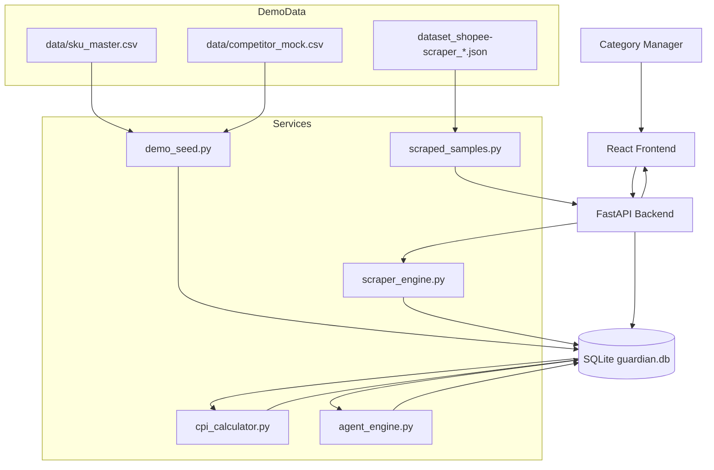
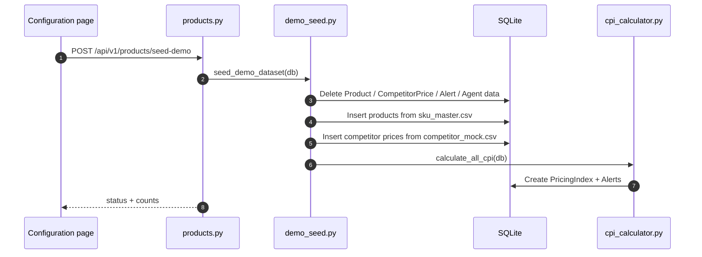
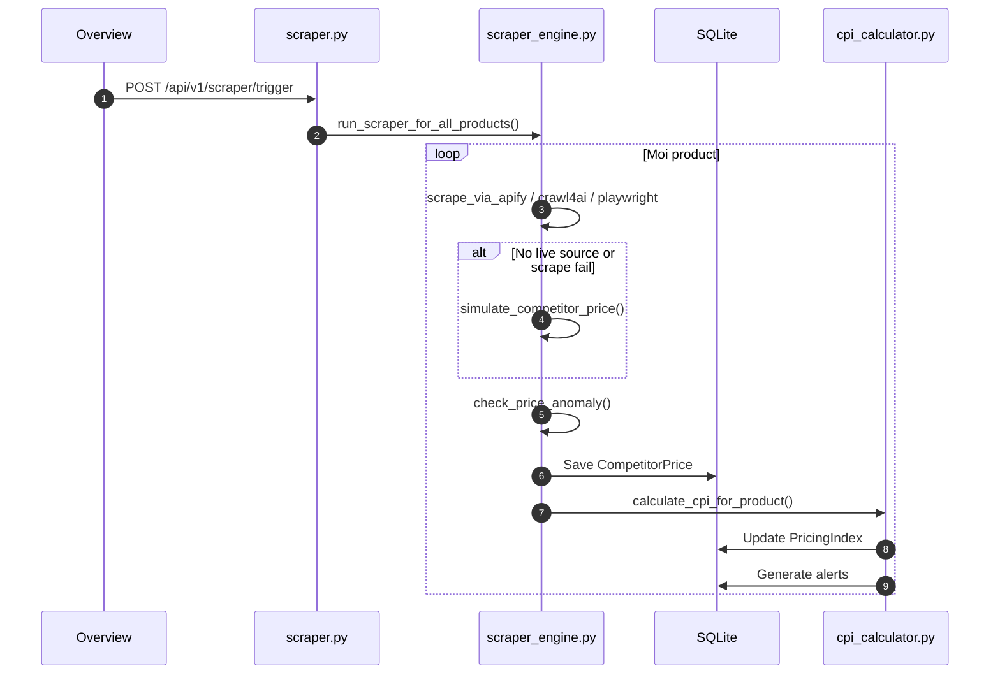
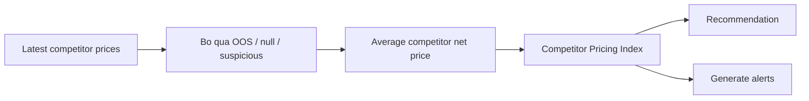
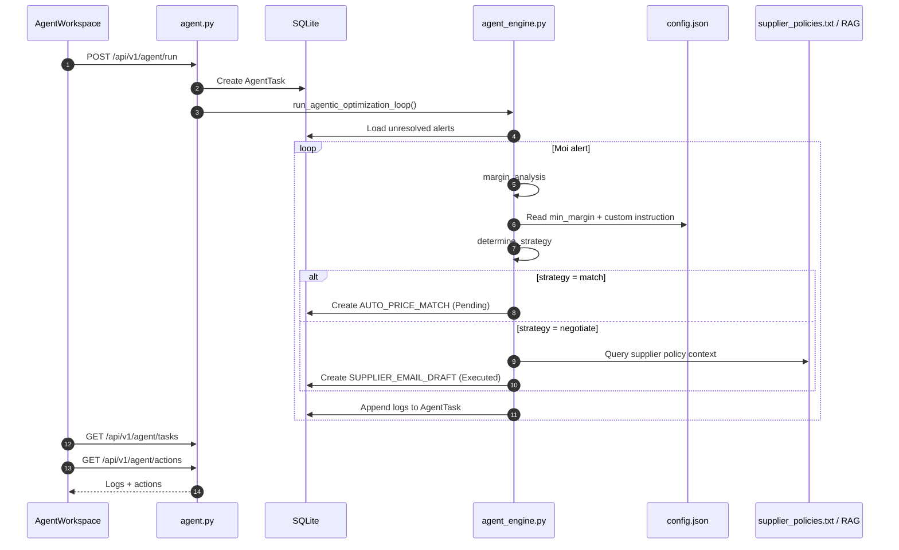
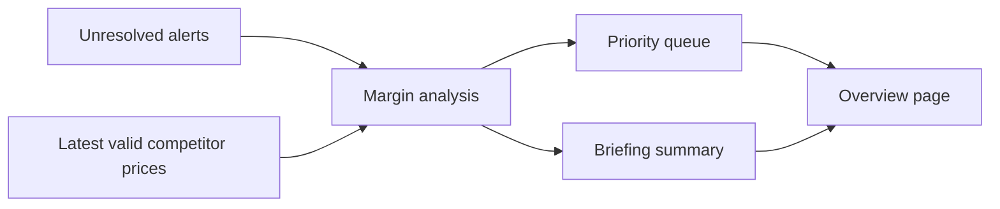
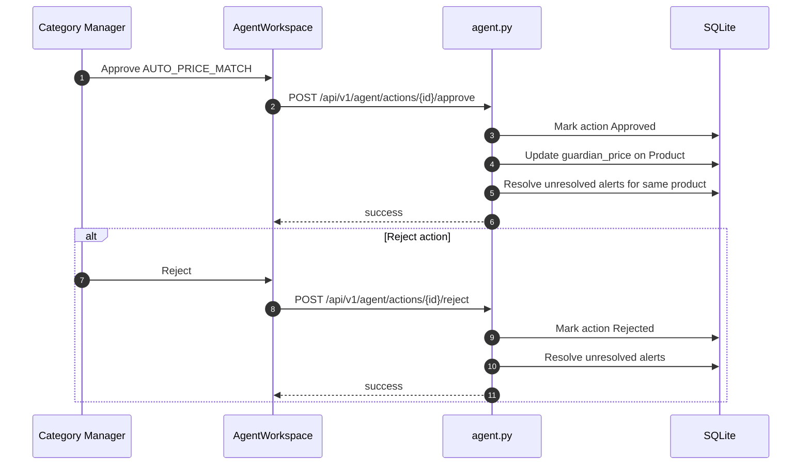
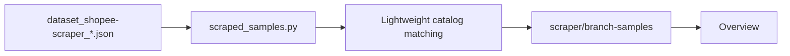

# TECHNICAL EXPLANATION

Tai lieu nay tap trung vao workflow thuc te cua codebase hien tai, khong theo boilerplate cu.

## 1. Workflow overview

Du an co 4 luong chinh:

1. Seed demo dataset
2. Scrape / refresh du lieu gia doi thu
3. Tinh CPI va tao alerts
4. Chay AI agent va human approval

## 2. Architecture workflow

## 3. Seed workflow

Workflow nay dung khi muon reset demo nhanh truoc luc thuyet trinh.

## 4. Scrape workflow

Workflow nay dung khi user bam "Scan channels".

## 5. CPI and alert workflow

Day la logic de bien du lieu gia thanh decision signal.

Chi tiet:

- `CPI = guardian_price / average_competitor_price * 100`
- Neu CPI cao hon threshold -> `Lower Price`
- Neu CPI thap hon threshold -> `Increase Price`
- Neu competitor undercut manh -> tao `High` hoac `Medium` alert

## 6. Agent workflow

Day la workflow quan trong nhat cho theme agentic AI.

## 7. Agent briefing workflow

Frontend mission control khong ghep du lieu thu cong nua. No dung `GET /agent/briefing`.

`build_alert_decision_context()` la ham trung tam o workflow nay.

No tra ra:

- product nao bi undercut
- competitor nao lien quan
- gap gia bao nhieu
- margin neu match
- recommendation `match` hay `negotiate`
- rationale de frontend hien thi

## 8. Human approval workflow

## 9. Branch `branch_of_Duy` workflow

Du lieu tu branch nay hien duoc dung nhu scrape evidence, khong phai full ingestion pipeline.

Muc dich:

- show bang chung scrape sample that
- map sample listing voi catalog hien tai neu co the
- tang do thuyet phuc cho pitch

## 10. Workflow de demo tren san khau

Thu tu nen dung:

1. Seed demo dataset
2. Mo Overview
3. Giai thich KPI, priority queue, branch sample evidence
4. Mo ProductInsights de show raw pricing detail
5. Chay agent trong AgentWorkspace
6. Approve 1 action
7. Quay lai Overview de cho thay state da thay doi

## 11. Ghi chu ky thuat

- Agent hien tai co the chay rule-based fallback neu khong co OpenAI key
- Scraper hien tai co the fallback sang simulated pricing
- Dashboard da duoc toi uu cho demo mission-control
- Frontend build trong moi truong nay van bi vuong issue Vite/esbuild voi protected parent directories
