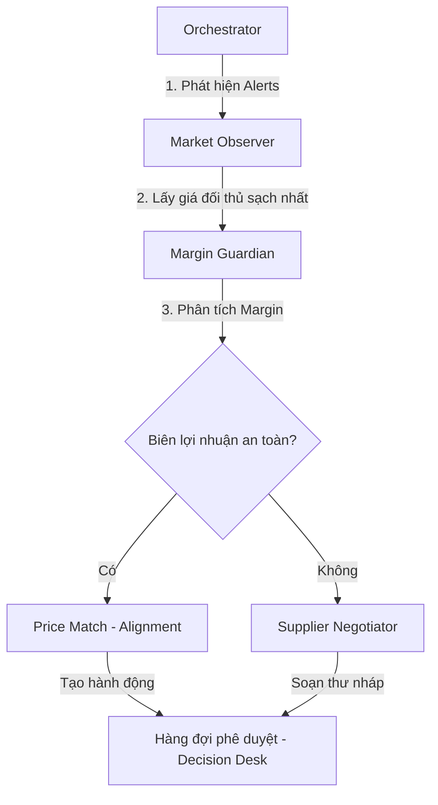

# TÀI LIỆU HƯỚNG DẪN HỆ THỐNG AI AGENT - GUARDIAN PRICING OS

Tài liệu này giới thiệu chi tiết về kiến trúc đa tác nhân (Multi-Agent Architecture) trong dự án Guardian Pricing OS, bao gồm mục đích, nguyên lý hoạt động, và các công cụ (tools) đi kèm của từng Agent.

Hệ thống được điều phối bằng **LangGraph** nhằm xử lý luồng trạng thái (State Graph) một cách tuần tự, đảm bảo tính nhất quán giữa phân tích tài chính và ra quyết định thương mại.

---

## 1. Tổng quan Kiến trúc Agent
Mô hình hoạt động của Guardian Pricing OS tuân theo nguyên lý:
`Observe (Quan sát) -> Detect (Phát hiện) -> Recommend (Đề xuất) -> Guard (Bảo vệ) -> Approve (Phê duyệt)`

Sơ đồ di chuyển trạng thái:

---

## 2. Các Agent trong Hệ thống

### 2.1. Agent Điều phối (Orchestrator)
* **Tệp mã nguồn**: [agent_orchestrator.py](file:///c:/Users/ADMIN/Desktop/tailieuhoc/STUDYYY/REPO/P3_TRACK-DETAIL-AND-HOSPILALITY/backend/app/agents/orchestrator/agent_orchestrator.py)
* **Mục đích**: Là đầu não điều phối toàn bộ vòng lặp hoạt động (Optimization Loop). Orchestrator chịu trách nhiệm quản lý phiên chạy (`AgentTask`), gọi cào dữ liệu mới, thu thập các cảnh báo chưa xử lý, chạy phân tích và lưu lại kết quả.
* **Cách thức hoạt động**:
  1. Kích hoạt cào giá đối thủ (nếu chọn refresh).
  2. Truy vấn các cảnh báo giá (`Alert`) chưa được giải quyết và sắp xếp thứ tự ưu tiên (Ưu tiên cảnh báo mức độ **High**).
  3. Duyệt qua từng sản phẩm bị cảnh báo và gọi **Margin Guardian** để phân tích.
  4. Lưu lại lịch sử suy nghĩ (`logs`) và các đề xuất hành động (`AgentAction`) xuống database.

---

### 2.2. Agent Quan sát thị trường (Market Observer)
* **Tệp mã nguồn**: [market_observer_agent.py](file:///c:/Users/ADMIN/Desktop/tailieuhoc/STUDYYY/REPO/P3_TRACK-DETAIL-AND-HOSPILALITY/backend/app/agents/market_observer/market_observer_agent.py) và [market_observer_tools.py](file:///c:/Users/ADMIN/Desktop/tailieuhoc/STUDYYY/REPO/P3_TRACK-DETAIL-AND-HOSPILALITY/backend/app/agents/market_observer/market_observer_tools.py)
* **Mục đích**: Trích xuất dữ liệu giá đối thủ "sạch nhất" phục vụ cho quá trình phân tích, loại bỏ các dữ liệu rác (hết hàng, giá bất thường).
* **Công cụ sử dụng (Tools)**:
  * `refresh_market_prices(db)`: Kích hoạt cào dữ liệu giá mới nhất.
  * `get_latest_clean_competitor_prices(db, product_id)`: Trích xuất lịch sử giá, lọc bỏ các dòng có trạng thái `OUT_OF_STOCK`, `net_price is None`, hoặc bị đánh dấu nghi ngờ `is_suspicious`.
  * `get_alert_reference_price(db, product, alert_type)`: Lựa chọn ra một mức giá đối thủ phù hợp nhất để làm mốc so sánh (lấy giá của đối thủ bán rẻ nhất).

---

### 2.3. Agent Bảo vệ biên lợi nhuận (Margin Guardian)
* **Tệp mã nguồn**: [margin_guardian_agent.py](file:///c:/Users/ADMIN/Desktop/tailieuhoc/STUDYYY/REPO/P3_TRACK-DETAIL-AND-HOSPILALITY/backend/app/agents/margin_guardian/margin_guardian_agent.py) và [margin_guardian_tools.py](file:///c:/Users/ADMIN/Desktop/tailieuhoc/STUDYYY/REPO/P3_TRACK-DETAIL-AND-HOSPILALITY/backend/app/agents/margin_guardian/margin_guardian_tools.py)
* **Mục đích**: Tính toán tác động tài chính của việc giảm giá và đưa ra chiến lược phù hợp nhằm bảo vệ biên lợi nhuận của doanh nghiệp.
* **Cách thức hoạt động**:
  * Agent chạy một phân tích tài chính dựa trên giá vốn (`cost_price`), giá hiện tại và giá đối thủ.
  * Nếu biên lợi nhuận dự kiến sau khi giảm giá bằng đối thủ **đạt mức an toàn** (mặc định $\ge 15\%$): Chọn chiến lược **Match Price** và tạo hành động đề xuất thay đổi giá.
  * Nếu biên lợi nhuận **không đạt mức an toàn** ($< 15\%$): Quyết định giữ nguyên giá bán lẻ và chuyển sang gọi **Supplier Negotiator** để yêu cầu nhà cung cấp hỗ trợ.
* **Công cụ sử dụng (Tools)**:
  * `compute_margin_scenarios(state)`: Tính toán biên lợi nhuận hiện tại và biên lợi nhuận giả định nếu hạ giá bằng đối thủ.
  * `propose_price_match(state)`: Tạo đề xuất thay đổi giá chi tiết gửi lên hàng đợi phê duyệt.

---

### 2.4. Agent Thương lượng với Nhà cung cấp (Supplier Negotiator)
* **Tệp mã nguồn**: [supplier_negotiator_agent.py](file:///c:/Users/ADMIN/Desktop/tailieuhoc/STUDYYY/REPO/P3_TRACK-DETAIL-AND-HOSPILALITY/backend/app/agents/supplier_negotiator/supplier_negotiator_agent.py) và [supplier_negotiator_tools.py](file:///c:/Users/ADMIN/Desktop/tailieuhoc/STUDYYY/REPO/P3_TRACK-DETAIL-AND-HOSPILALITY/backend/app/agents/supplier_negotiator/supplier_negotiator_tools.py)
* **Mục đích**: Tự động soạn thảo các thư điện tử thương lượng hỗ trợ chi phí gửi đến nhà quản lý nhãn hàng của nhà cung cấp khi Guardian không thể tự hạ giá bán lẻ.
* **Cách thức hoạt động**:
  1. Tra cứu chính sách hỗ trợ giá đã ký kết với thương hiệu tương ứng (Bioderma, La Roche-Posay, Anessa...).
  2. Lấy thông tin liên hệ của đại diện hãng từ cơ sở dữ liệu.
  3. Lập luận và điền các số liệu tài chính thực tế (khoảng cách giá, giá vốn, giá đối thủ) vào email template để gửi đi.
* **Công cụ sử dụng (Tools)**:
  * `lookup_supplier_policy(state)`: Tra cứu chính sách hỗ trợ (ví dụ: Bioderma hoàn tiền 12,000 VND/sản phẩm đối với trường hợp bị phá giá).
  * `generate_supplier_email(state)`: Soạn email thương lượng tự động điền sẵn tiêu đề, người nhận và nội dung lập luận.

---

## 3. Tóm tắt các Tool quan trọng trong Hệ thống

| Tên Tool | Agent sử dụng | Nhiệm vụ |
| :--- | :--- | :--- |
| `refresh_market_prices` | Market Observer | Kích hoạt bộ thu thập dữ liệu đa kênh (Apify / Playwright / Crawl4AI). |
| `compute_margin_scenarios` | Margin Guardian | Tính biên lợi nhuận hiện tại & biên lợi nhuận giả định sau khi khớp giá đối thủ. |
| `propose_price_match` | Margin Guardian | Tạo đề xuất điều chỉnh giá bán lẻ gửi tới Operator. |
| `lookup_supplier_policy` | Supplier Negotiator | Tra cứu chính sách hỗ trợ thương mại và thông tin liên lạc của đại diện nhãn hàng đối tác. |
| `generate_supplier_email` | Supplier Negotiator | Tạo email nháp thương lượng chi phí dựa trên dữ liệu chênh lệch giá thực tế. |

---

## 4. Đặc điểm nổi bật của Hệ thống
1. **Lập luận có cấu trúc (Chain of Thought)**: Hệ thống ghi nhận lại toàn bộ "suy nghĩ" thực tế của Agent dưới dạng nhật ký hành động từng bước (ví dụ: phân tích giá nào, tính được margin bao nhiêu, so sánh với mốc an toàn ra sao) hiển thị lên màn hình console cho người dùng giám sát.
2. **Khép kín (Closed Loop)**: Tự động hóa hoàn toàn từ bước thu thập giá thị trường $\rightarrow$ Phân tích $\rightarrow$ Đề xuất hành động, chỉ cần con người nhấn nút duyệt (**Approve**) là giá bán được đồng bộ và CPI tự tính lại ngay lập tức.
3. **Deterministic & Auditable**: Không sử dụng mô hình LLM tự do định giá để tránh rủi ro ảo giác (hallucination). Hệ thống chạy trên LangGraph phối hợp với bộ công cụ tính toán toán học chính xác để đảm bảo mọi hành động đổi giá đều có thể giải trình và kiểm toán được.
