# GUARDIAN PRICING OS - CURRENT ARCHITECTURE

Sơ đồ này phản ánh code hiện tại. Pricing decision là rule-based/template; không có LLM hoặc RAG trong logic đặt giá.

```mermaid
flowchart LR
    A[CSV / JSON catalog] --> B[Dynamic ingestion]
    B --> C[(Product catalog)]
    C --> D[Search-driven link discovery]
    D --> E[(Competitor links)]

    F[Daily scheduler / Manual refresh] --> G[Market Observer]
    C --> G
    E --> G

    G --> H{Channel connector}
    H --> H1[Apify]
    H --> H2[Playwright]
    H --> H3[Crawl4AI]
    H --> H4[Deterministic fallback]

    H1 --> I[Effective-price normalizer]
    H2 --> I
    H3 --> I
    H4 --> I
    I --> J[(Competitor price history)]

    J --> K[CPI + anomaly engine]
    K --> L[(Pricing alerts)]
    L --> M[Rule orchestrator]
    M --> N[Margin Guardian]

    N --> O{Margin after alignment}
    O -->|Above floor| P[Price-alignment proposal]
    O -->|Below floor| Q[Supplier-support draft]

    P --> R[(Pending action)]
    Q --> R
    R --> S{Commercial operator}
    S -->|Approve| T[Apply action + recalculate CPI]
    S -->|Reject| U[Dismiss action]

    G -. trace .-> V[Langfuse]
    M -. decision summary .-> V
    N -. tool events .-> V

    classDef guardian fill:#ffd400,stroke:#1d1d1b,color:#1d1d1b,stroke-width:2px;
    classDef store fill:#ffffff,stroke:#66665f,color:#1d1d1b;
    classDef decision fill:#fff7cc,stroke:#d4ad00,color:#1d1d1b;
    classDef action fill:#e9f6f0,stroke:#16825d,color:#1d1d1b;

    class B,G,I,K,M,N guardian;
    class C,E,J,L,R store;
    class H,O,S decision;
    class P,Q,T,U action;
```

## Ownership

- `services/data_ingestion.py`: catalog import and validation
- `services/link_discovery.py`: competitor link registry
- `scraper/scraper_engine.py`: channel connectors and fallback
- `services/platform_mappers.py`: effective-price normalization
- `services/cpi_calculator.py`: CPI, anomaly and alerts
- `agents/orchestrator/`: decision-cycle coordination
- `agents/margin_guardian/`: margin scenarios and strategy
- `agents/supplier_negotiator/`: supplier-support template
- `agents/shared/runtime_support.py`: Langfuse observations
- `routes/agent.py`: human approval and CPI recalculation

## Legacy image

Sơ đồ cũ trước khi bỏ LLM/RAG được giữ tại `docs/archive/legacy-agent-architecture-pre-rule-based.png` chỉ để lưu lịch sử, không phản ánh runtime hiện tại.
